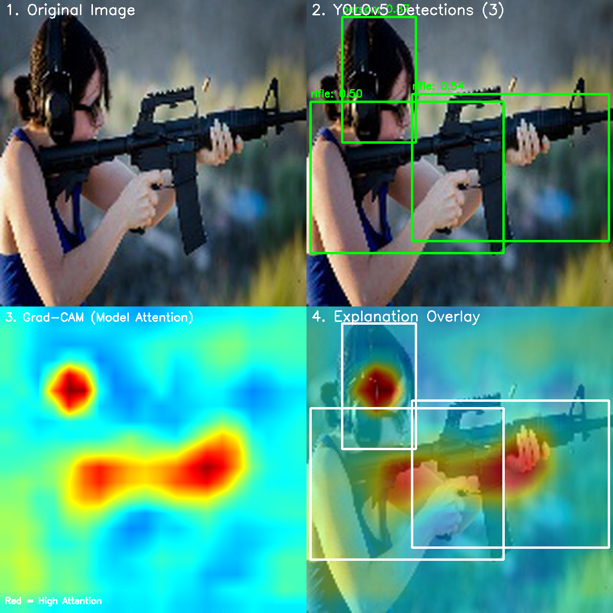
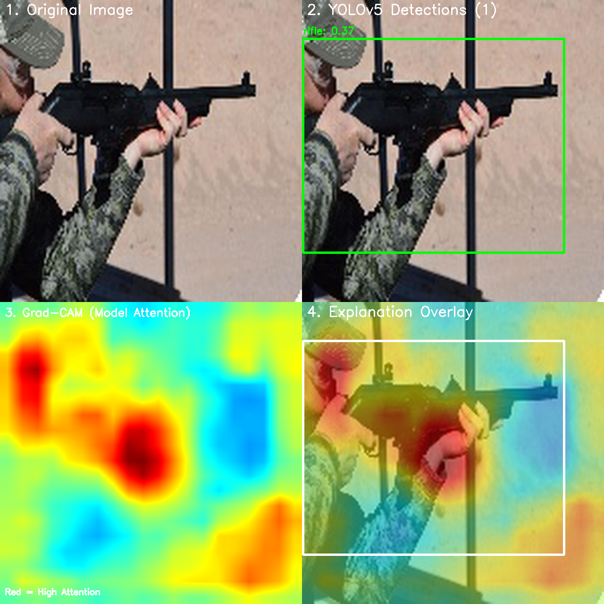
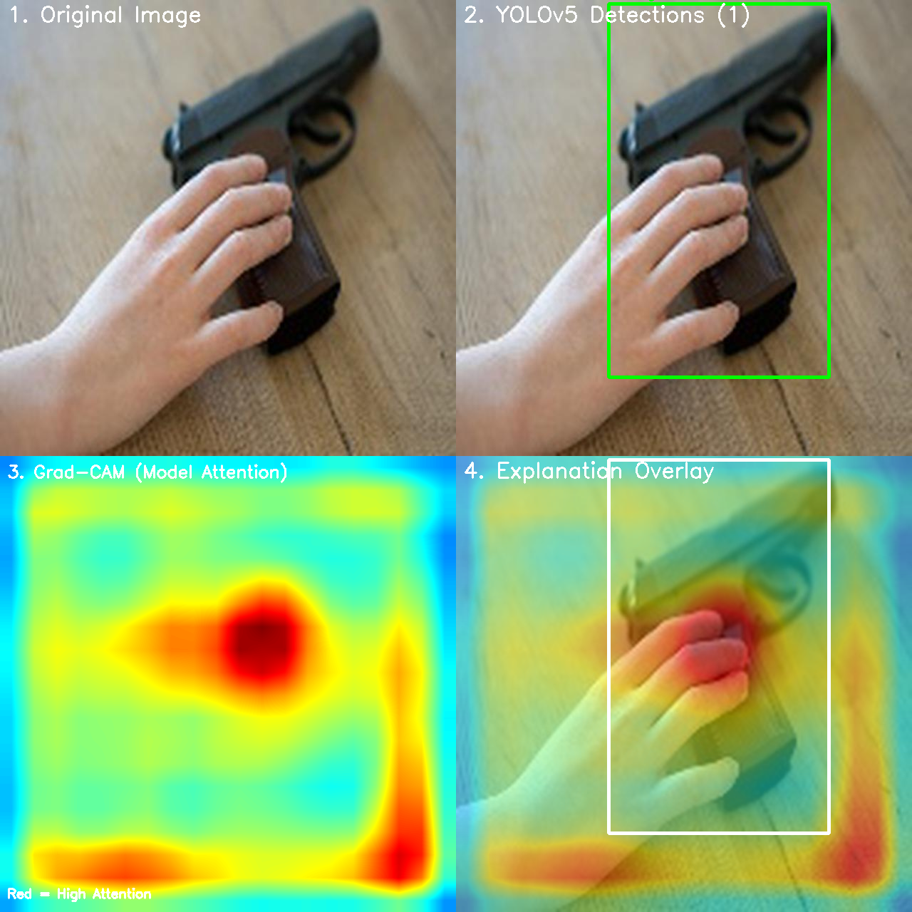
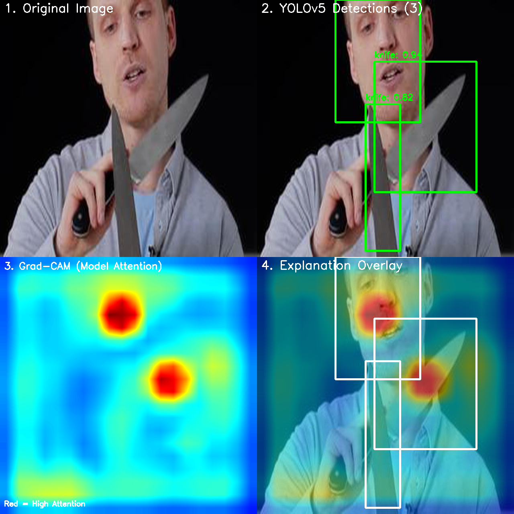

# Explainable AI for Weapon Detection using Grad-CAM

This project applies **Explainable AI (XAI)** techniques — specifically **Gradient-weighted Class Activation Mapping (Grad-CAM)** — to weapon detection models. The goal is to go beyond just asking *"what did the model detect?"* and actually understand *"where is the model looking, and why did it make that decision?"*

Two detector architectures are studied:
- **YOLOv5** (small, medium, and large variants)
- **Detectron2 Faster R-CNN** (ResNet50-C4 backbone)

---

## What is Grad-CAM?

Most deep learning models are black boxes — they give you an answer, but not a reason. **Grad-CAM** solves this by using the gradients flowing back through the network to highlight the regions in an image that most influenced the prediction.

In plain terms: the heatmap shows **what the model was paying attention to** when it made its decision.

```
Input Image  →  Object Detector  →  Detections
                     ↓
             Backward Pass (Gradients)
                     ↓
             Feature Map Weighting
                     ↓
             Heatmap  →  Overlay on Image
```

Red/warm areas = high attention  
Blue/cool areas = low attention

---

## Detected Classes

The models are trained to detect **5 weapon-related classes**:

| Class ID | Class Name |
|----------|------------|
| 0 | handgun |
| 1 | knife |
| 2 | person |
| 3 | revolver |
| 4 | rifle |

---

## Repository Structure

```
ExplainableAI/
│
├── gradcam_single.ipynb            # XAI on a single image using YOLOv5 small
├── gradcam_batch_yolov5.ipynb      # Batch XAI on all test images using YOLOv5 large
├── gradcam_detectron2_single.ipynb # XAI on a single image using Detectron2 Faster R-CNN
│
├── weights/
│   ├── test/                       # 10 test weapon images
│   ├── yolov5_small/
│   │   ├── best.pt                 # YOLOv5s trained weights
│   │   └── xai_output/            # Grad-CAM results (small model)
│   ├── yolov5_med/
│   │   ├── best.pt                 # YOLOv5m trained weights
│   │   └── xai_output/            # Grad-CAM results (medium model)
│   ├── yolov5_lar/
│   │   ├── best.pt                 # YOLOv5l trained weights
│   │   └── xai_output/            # Grad-CAM results (large model)
│   └── fastercnn/
│       └── resnet50c4/
│           └── model_final.pth    # Detectron2 Faster R-CNN weights
│
└── yolov5/                         # YOLOv5 source (git submodule)
```

---

## Model Details

### YOLOv5 Variants

| Variant | Layers | Parameters | Weights Size |
|---------|--------|------------|--------------|
| YOLOv5s (small) | 224 | 7,064,698 | ~14 MB |
| YOLOv5m (medium) | — | — | ~41 MB |
| YOLOv5l (large) | 392 | 46,604,156 | ~89 MB |

**Grad-CAM target layer:** `model.23.m.0.cv2.conv` (4th from last Conv2d layer)

### Detectron2 Faster R-CNN

- **Backbone:** ResNet50-C4
- **Weights size:** ~252 MB
- **Grad-CAM target layer:** `res5[-1].conv3` (final conv in the C4 stage)

---

## Setup & Installation

### Prerequisites

- Python 3.8+
- PyTorch (CPU or GPU)
- OpenCV
- Jupyter Notebook / JupyterLab

### 1. Clone the repository

```bash
git clone --recurse-submodules https://github.com/akhilakambhatla/explainable-AI.git
cd explainable-AI
```

> The `--recurse-submodules` flag is needed to also pull in the `yolov5/` source code.

### 2. Install dependencies

```bash
pip install torch torchvision opencv-python numpy matplotlib jupyter
```

For the Detectron2 notebook, install Detectron2 separately:

```bash
# CPU only
pip install detectron2 -f https://dl.fbaipublicfiles.com/detectron2/wheels/cpu/torch2.0/index.html

# CUDA 11.8
pip install detectron2 -f https://dl.fbaipublicfiles.com/detectron2/wheels/cu118/torch2.0/index.html
```

### 3. Pull Git LFS files (model weights)

```bash
git lfs pull
```

---

## How to Use

### Single Image — YOLOv5

Open `gradcam_single.ipynb` and update the paths in the relevant cells:

```python
weights_path = "weights/yolov5_small/best.pt"   # or yolov5_med / yolov5_lar
image_path   = "weights/test/weapon32.jpg"        # your test image
```

Run all cells. The notebook will:
1. Load the YOLOv5 model
2. Run detection on the image
3. Generate a Grad-CAM heatmap via backward hooks
4. Save a 4-panel visualization

### Batch Processing — YOLOv5

Open `gradcam_batch_yolov5.ipynb` and update:

```python
weights_path  = "weights/yolov5_lar/best.pt"
test_folder   = "weights/test/"
output_folder = "weights/yolov5_lar/xai_output/"
```

This processes every image in the test folder and saves individual XAI results.

### Single Image — Detectron2

Open `gradcam_detectron2_single.ipynb` and update:

```python
weights_path = "weights/fastercnn/resnet50c4/model_final.pth"
test_image   = "weights/test/weapon115.jpg"
```

---

## Detection & Inference Settings

| Parameter | Value |
|-----------|-------|
| Input size | 640 × 640 |
| Confidence threshold | 0.25 |
| IoU threshold (NMS) | 0.45 |
| Device | CPU / CUDA (auto-detected) |

---

## How Grad-CAM Works Here

The implementation follows these steps for every image:

```
1. Load pretrained model
        ↓
2. Register forward & backward hooks on target Conv2d layer
        ↓
3. Forward pass → run inference → get highest confidence score
        ↓
4. Backward pass → compute gradients w.r.t. target layer
        ↓
5. Global average pool gradients → get per-channel weights
        ↓
6. Weighted sum of activation maps → apply ReLU → normalize
        ↓
7. Resize CAM to 640×640 → apply JET colormap
        ↓
8. Overlay heatmap on original image with bounding boxes
```

**Fallback method:** If inplace operations in the model prevent gradient flow, the implementation automatically switches to an activation-magnitude approach (mean absolute activation across channels), which gives a good approximation without requiring a backward pass.

---

## Results

Each output is a **4-panel visualization**:

| Panel | Description |
|-------|-------------|
| 1. Original Image | The raw input image |
| 2. YOLOv5 Detections | Bounding boxes with class labels and confidence scores |
| 3. Grad-CAM Heatmap | Pure attention map — red = high focus, blue = low focus |
| 4. Explanation Overlay | Heatmap blended over original image with detection boxes |

### YOLOv5 Small — Sample Results

<table>
  <tr>
    <td align="center"><br><em>weapon32</em></td>
    <td align="center"><br><em>weapon86</em></td>
  </tr>
</table>

### YOLOv5 Large — Sample Results

<table>
  <tr>
    <td align="center"><br><em>weapon115</em></td>
    <td align="center"><br><em>weapon345</em></td>
  </tr>
</table>

## Acknowledgements

- [YOLOv5 by Ultralytics](https://github.com/ultralytics/yolov5)
- [Detectron2 by Facebook AI Research](https://github.com/facebookresearch/detectron2)
- Grad-CAM: *Selvaraju et al., "Grad-CAM: Visual Explanations from Deep Networks via Gradient-based Localization," ICCV 2017.*
